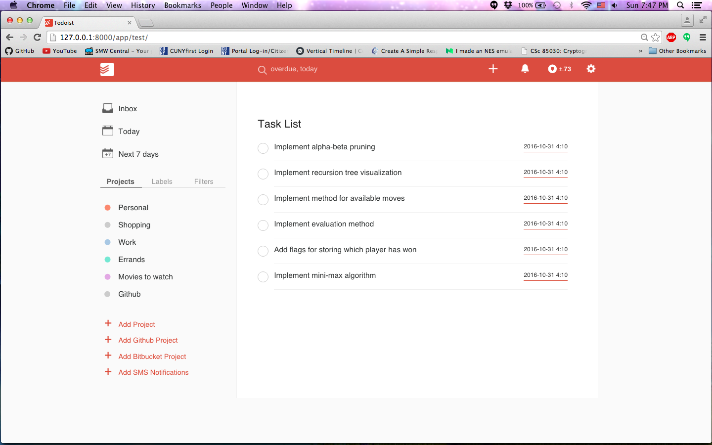

# Hacker Todoist

Repository for our TNW Hack Battle project - Hacker Todoist, built using Django and the Github, Bitbucket, Twilio and Todoist APIs. 

## What is it?

Hacker Todoist is an extension to the existing platform over at [Todoist](https://todoist.com/), which provides an extensive
API for managing everyday tasks and creating lists to contain these tasks. 

In this hack, we created a mockup of the existing website as shown above, and aimed to seamlessly add the ability for users to:

* Create `Projects` on Todoist based on a Github / Bitbucket repository
* Recieve text messages when tasks are soon to be due
* End-to-End integration with Github using Webhooks: closing/opening an issue would correlate to an issue being completed in the corresponding Todoist project. 

## Installation

In order to run this project, follow the steps below:

	# install the requirements
	pip install -r requirements.txt

	# install mongodb
	brew install mongodb

	# Run mongodb in separate terminal
	mongod

	# create the database tables
	python manage.py migrate

	# make the database migrations
	python manage.py makemigrations

	# run the python server
	python manage.py runserver

	# navigate to 127.0.0.1:8000/app/test/

### Github Webhook

In order to successfully use webhooks on Github in order to update an issue within a Todoist Project, we can configure a webhook url within a Github repository settings and specify a url which is generated through running [ngrok](https://ngrok.com/). `ngrok` is needed to create an accessible tunnel for localhost, as Github does not allow `localhost` as a valid webhook url. 

	# Run ngrok
	./ngrok 127.0.0.1:8000/app/events/ 

	# Copy one of the generated urls to use as a webhook:
	http://4b2087a5.ngrok.io/app/events

### Twilio API

In order to send messages to a user through Twilio, you'll need to sign up and create an API key [here](https://www.twilio.com/api). Once this is done, add in your `account_sid`, `auth_token`, and `twilio_number` to the commented sections within `views.py`.

## Future Ideas

While this project was developed in haste, a few features are left to be improved upon:

* Complete AJAX for resyncing of a Todoist Project whenever it received notifications from a webhook without a page refresh
* Ability to unsubscribe a user from the SMS Twilio Service (simply remove a user from the database)
* Ability to also grab labels from the Github API and automatically create and assign them to corresponding tasks in a Todoist Project
* Ability to grab all comments from an issue on Github/Bitbucket to populate corresponding tasks in a Todoist Project
* Integrate Google Calendar support using OAuth
* Integrate Trello support

